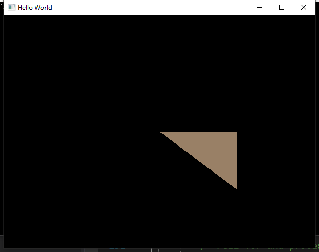

# What is a shader?

Basically，shader is juts a batch of program used for shading , we here just define 2D Shader in OpenGL

we can also dirive shader into 2 type:

- vertex shader : used for shading vertex
- fragment shader : used for shading all of pixel between the vertex

# Shader in OpenGL

simply to define a vertex shader and fragment shader in OpenGL in a file named "Basic.shader"

using programming language named "glsl"(OpenGL Shading Language) , check it here for more [detail](https://en.wikipedia.org/wiki/OpenGL_Shading_Language)

```glsl
#shader vertex  //here just to divide two segment,no other signature
#version 330 core

layout(location = 0) in vec4 position; //define a position

void main(){
   gl_Position = position;             //gl_Positon is a special gloabal variable here
}

#shader fragment
#version 330 core

layout(location = 0) out vec4 color;  

void main(){
   color = vec4(0.5,0.0,0.0,0.6);       //special global variable here too
}

```

Then , let us read it into our cpp program

```cpp
//@param source code file path 
static ShaderProgramSource parseShader(const std::string& shaderFilePath) { //parse file into string
    std::ifstream stream(shaderFilePath);
    
    enum class ShaderType {
        NONE = -1, VERTEX = 0 , FRAGMENT = 1
    };

    std::string line;
    std::stringstream ss[2];

    ShaderType type = ShaderType::NONE; //default type is none

    while (std::getline(stream,line)) {
        if (line.find("#shader") != std::string::npos) { //if find "#shader"
            if (line.find("vertex") != std::string::npos) { //set mode to vertex
                type = ShaderType::VERTEX;
            }
            else if (line.find("fragment") != std::string::npos) { //set mode to fragment
                type = ShaderType::FRAGMENT;
            }
        }
        else ss[(int)type] << line << '\n';
    }
    return { ss[0].str(),ss[1].str()}; //return 2 segement of shader source

}
```

- compile our shader code 
- binding with a program in GPU
- return program id

```cpp
static unsigned int CreateShader(const std::string& vertexShader, const std::string& fragmentShader) {
    unsigned int program = glCreateProgram();
    unsigned int vs = CompileShader(vertexShader, GL_VERTEX_SHADER);
    unsigned int fs = CompileShader(fragmentShader, GL_FRAGMENT_SHADER);
    
    //binding compiled shader to program
    glAttachShader(program, vs);
    glAttachShader(program, fs);

    //---What is this?--------------
    glLinkProgram(program);
    glValidateProgram(program);
    //----------------------------

    glDeleteShader(vs);  //delete the shader because both of vertex&fragmentShader are binding into our program
    glDeleteShader(fs);

    return program;
}
```

finally , make sure use program in GPU

```cpp
ShaderProgramSource source = parseShader("res/shaders/Basic.shader");

std::cout << source.vertexSource << std::endl;
std::cout << source.fragmentSource << std::endl;

unsigned int shader = CreateShader(source.vertexSource, source.fragmentSource);
glUseProgram(shader); //use program here
```

- Now we get a triangle here successfully !  your can also change the color or vertex positon on your own
- That's the most basic costom shader we can write simply



