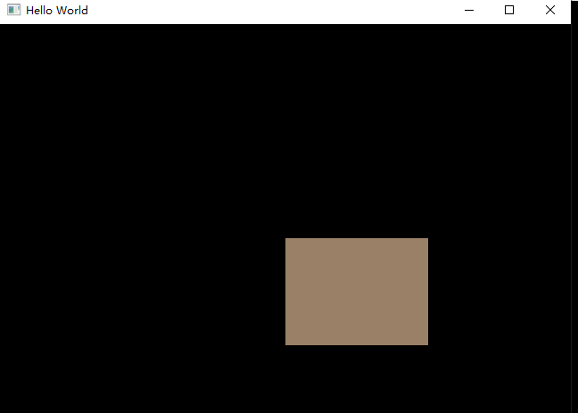

# What is Index Buffers?

Index Buffers are something make you reuse vertex porperly

The 3D meshes you'll be rendering in a real world application will often share vertices between multiple triangles. This already happens even with something simple like drawing a rectangle: 


Drawing a rectangle takes two triangles, which means that we need a vertex buffer with 6 vertices. The problem is that the data of two vertices needs to be duplicated resulting in 50% redundancy. It only gets worse with more complex meshes, where vertices are reused in an average number of 3 triangles. The solution to this problem is to use an *index buffer*.

An index buffer is essentially an array of pointers into the vertex buffer. It allows you to reorder the vertex data, and reuse existing data for multiple vertices. The illustration above demonstrates what the index buffer would look like for the rectangle if we have a vertex buffer containing each of the four unique vertices. The first three indices define the upper-right triangle and the last three indices define the vertices for the bottom-left triangle^[[reference](https://vulkan-tutorial.com/Vertex_buffers/Index_buffer)].

# Basic Index Buffers in OpenGL

Here we generate a index buffer 

```cpp
unsigned int ibo; //buffer binding id in VM
glGenBuffers(1, &ibo); //real memo in windows
glBindBuffer(GL_ELEMENT_ARRAY_BUFFER, ibo); //bind the above of them
glBufferData(GL_ELEMENT_ARRAY_BUFFER, 6 * sizeof(unsigned int), indices ,GL_STATIC_DRAW);//binding indices data in Buffer
```

 And see the positon and indices we define , it means here we have 4 vertex , and what we wanna do is to draw triangle in order that has define in indices , so we will draw 0 , 1, 3 , 2 , 3 ,0 and get a rectangle

```cpp
float position[] = {
    0.0f,  0.0f, //0
    0.5f,  0.0f, //1
    0.5f, -0.5f, //2
    0.0f, -0.5f  //3 
};

unsigned int indices[] = {  //draw order
    0,1,2, 
    2,3,0
};
```

Finally , just call glDrawElements() function to draw it inorder 

```cpp
// because we have bind &ibo into buffer
// so here we give a nullptr to the last arg
glDrawElements(GL_TRIANGLES, 6, GL_UNSIGNED_INT, nullptr); 
```

And it really works

